# Smooth Turn Waypoints

Motion path post-processor for a 2D gantry jetting dispenser.

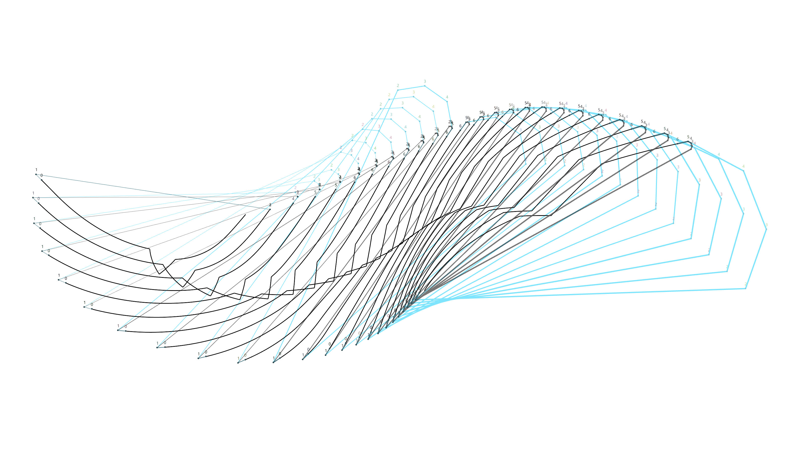

## Problem

High-speed gantry travel causes overshoot at dispensing points. The dispenser activates within a trigger radius (~300 μm) of each target — if the head approaches too fast or at the wrong angle, dot placement error increases significantly.

| Before | After |
|---|---|
| 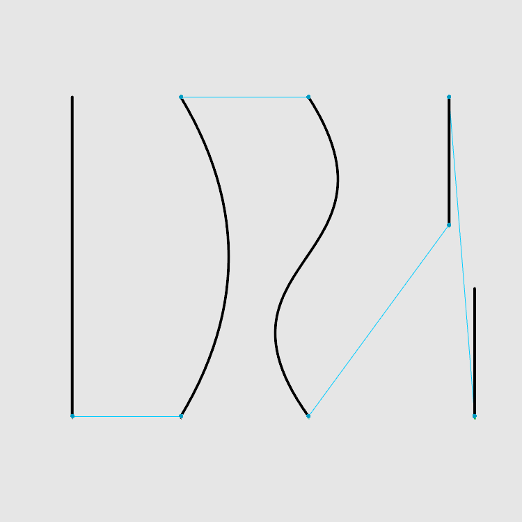 | 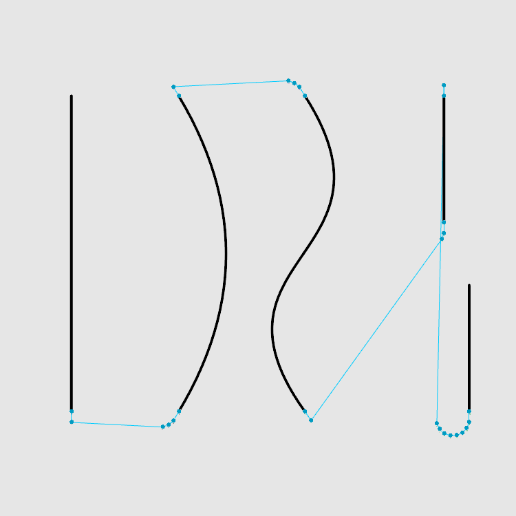 |

## Solution

Insert entry waypoints between strokes using angle-capped polygonal turns and forward offsets, so the gantry decelerates and aligns before entering the trigger zone.

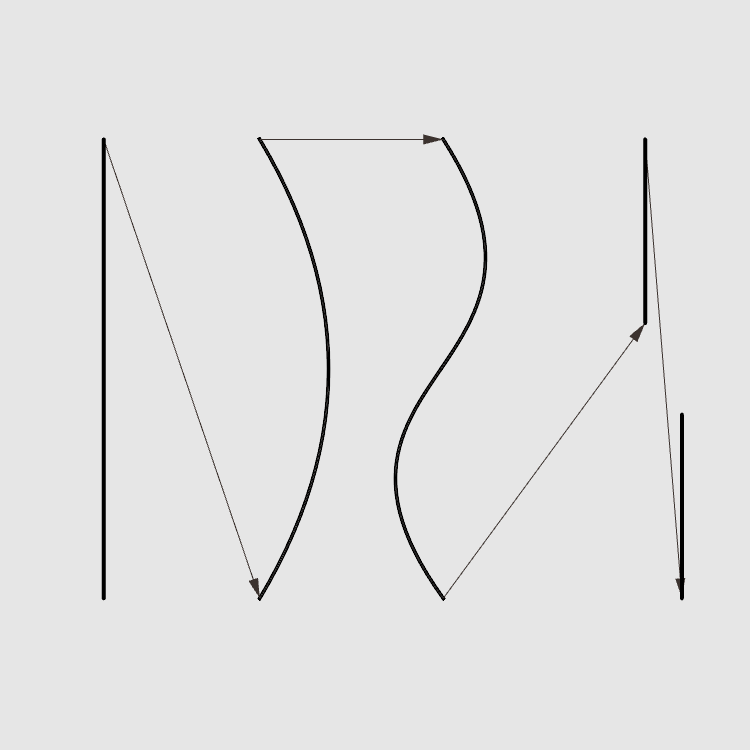

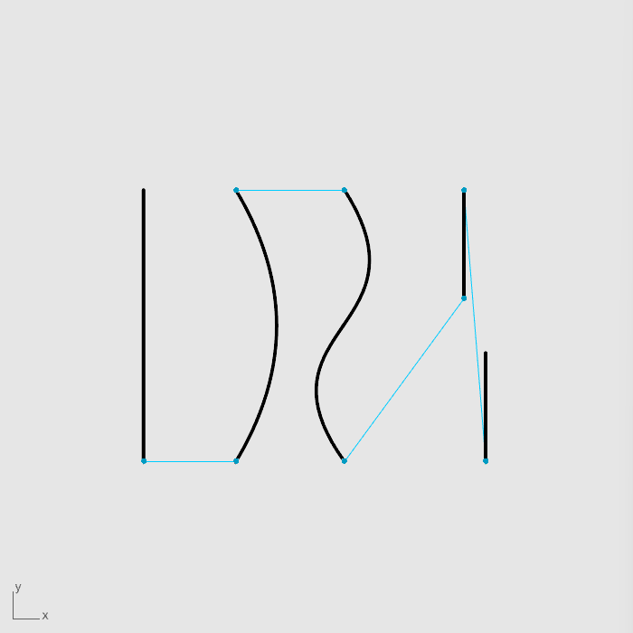

## Parameters

| Parameter | Description |
|---|---|
| `extend_len` | Lead-in distance before the first dispensing point (mm) |
| `theta_max_deg` | Max turn angle per waypoint step (degrees) |
| `step_len` | Step length along the turn arc (mm) |

## Details

- **Normal turn**: polygonal fillet with angle-capped steps

  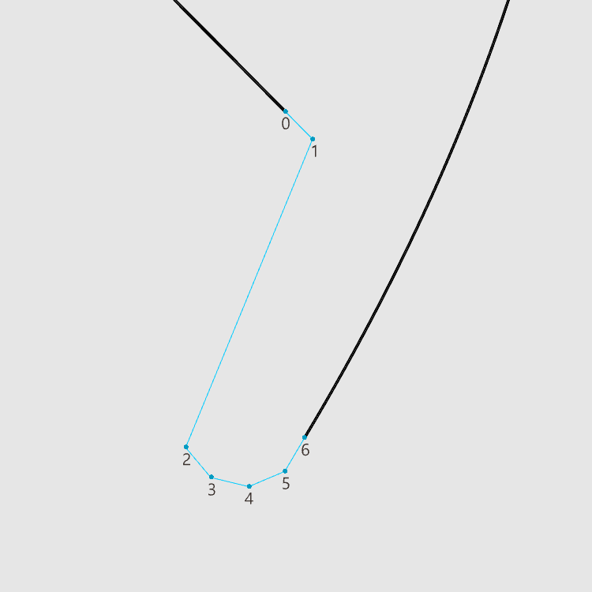

- **U-turn**: handled as a special case with a dedicated turn sequence

  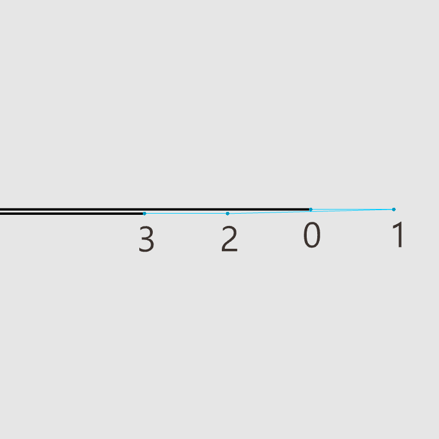

  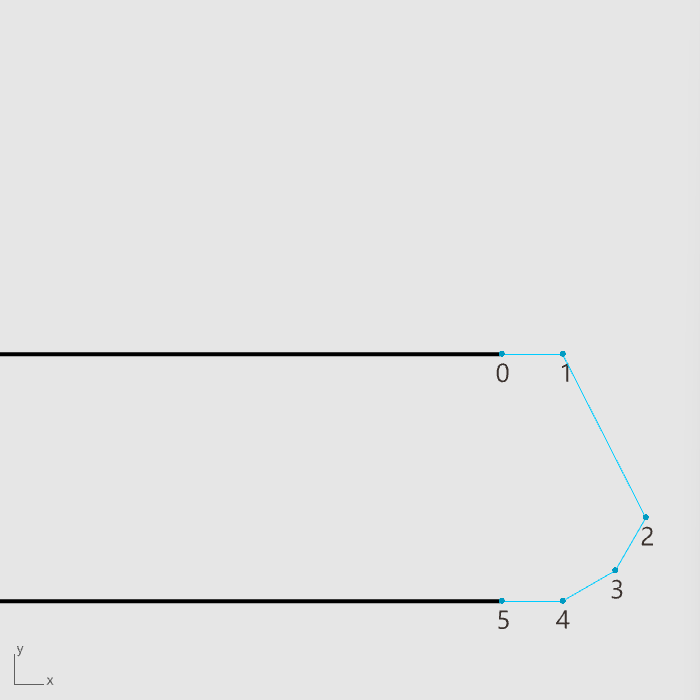

- **Insufficient space**: extend-only fallback, no rotation
- Reads stroke geometry from Grasshopper point tree
- Outputs travel polylines and waypoint positions

## Screenshots

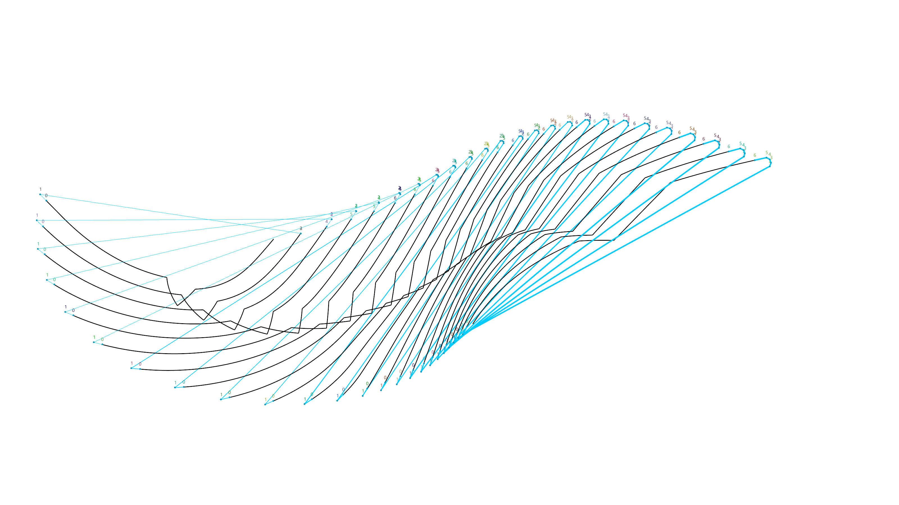
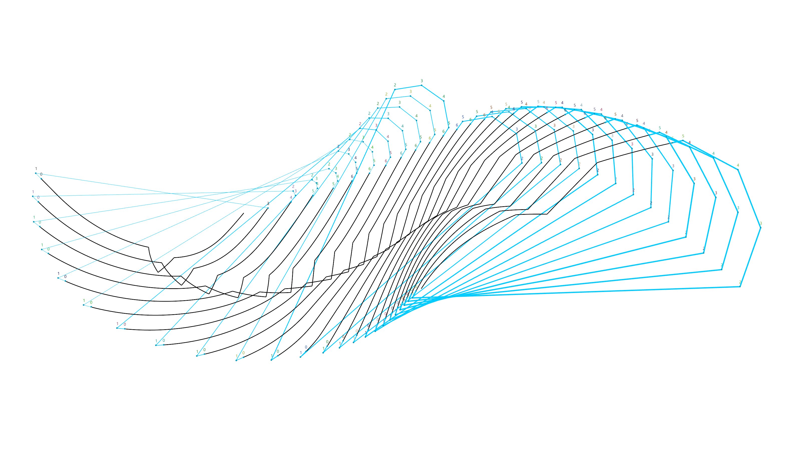
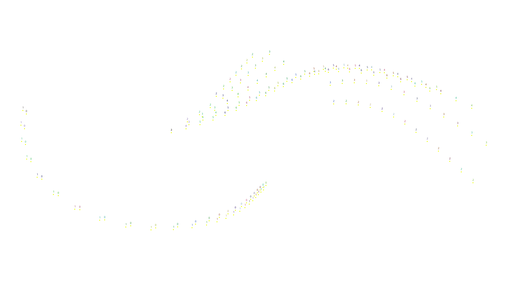
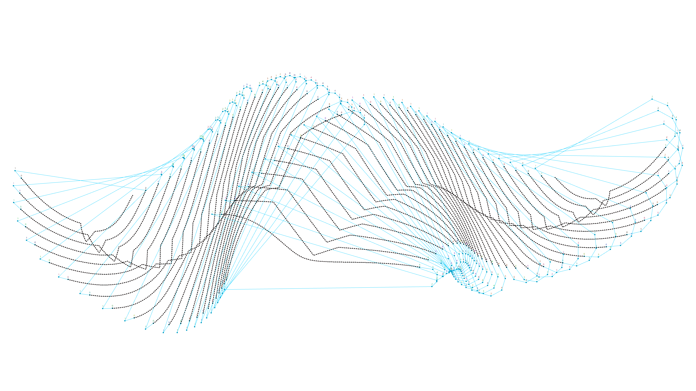
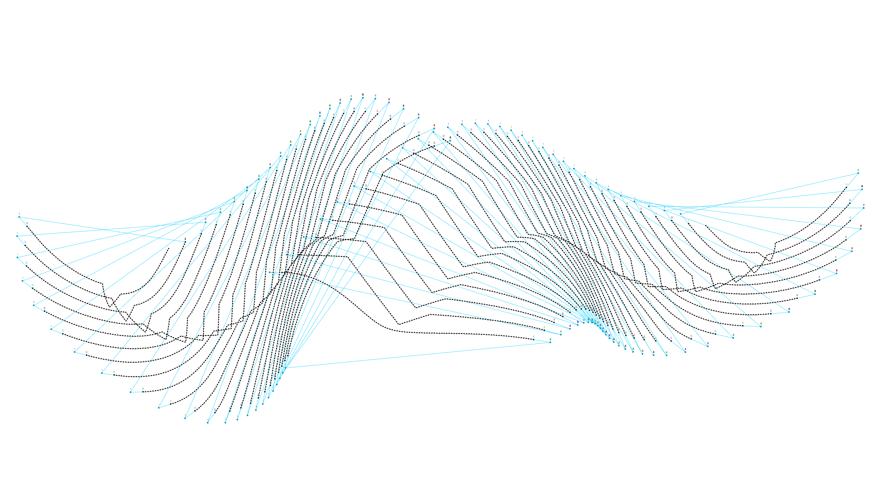

## Related

- [nearest-neighbor-routing](https://github.com/ChanYenFen/nearest-neighbor-routing) — travel order optimization for the same machine